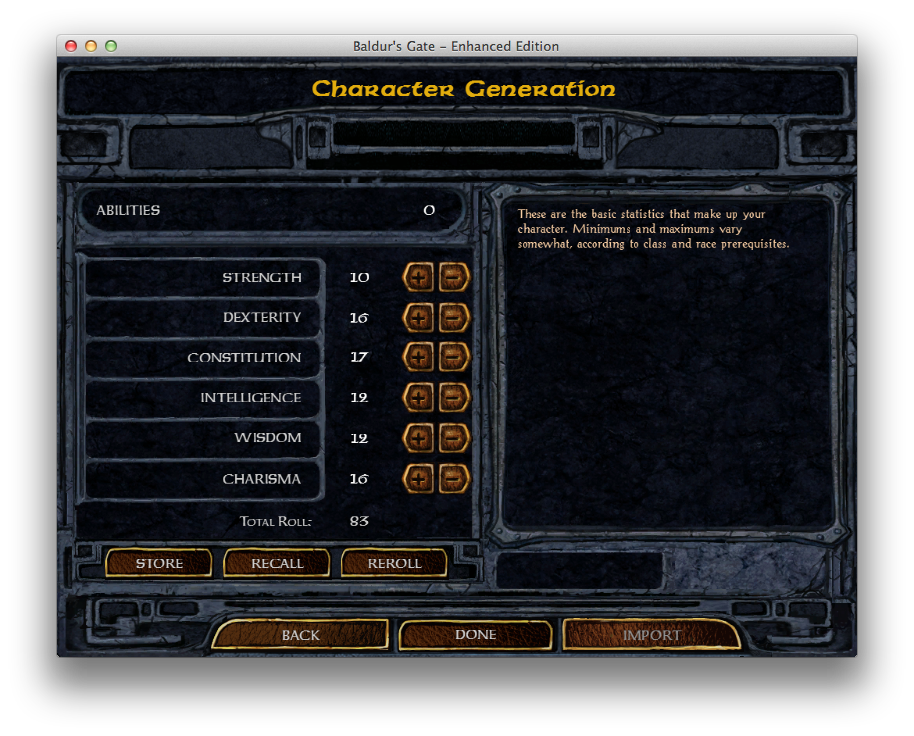

# BGEE Sikuli Auto Roller

## About
This is a script for [Sikuli IDE](http://www.sikuli.org) which automates repeated rolling for attributes during the character creation process of the game [Baldur's Gate: Enhanced Edition](http://www.baldursgate.com).

Licensed with MIT License (see `LICENSE` file).

## Prerequisites
To run this script, you need [Sikuli IDE](http://www.sikuli.org).  See  [sikuli.org/download.html](http://www.sikuli.org/download.html) for information and downloads.  This script was developed and tested using **Sikuli IDE 1.0.1** on Mac OS X 10.8, but will likely work on other platforms.

## Running

### Game Setup
For best results, run *Baldur's Gate: Enhanced Edition* in a 800x600 window.  You can edit the `Baldur.ini` file to set the size explicitly.  `Baldur.ini` is found:

* `~/Documents/Baldur's Gate - Enhanced Edition/Baldur.ini`
* `%USERPROFILE%\MY DOCUMENTS\Baldur's Gate - Enhanced Edition\Baldur.ini` ***(unverified)***

Within the `INSERT INTO options ROWS(...)` section, add or replace the following settings:

    	'Window',	'Full Screen',	'0',
    	'Window',	'w',	'800',
    	'Window',	'h',	'600',

See [the baldursgate.com forums for more information on customizing your game](http://forum.baldursgate.com/discussion/8317/how-to-manually-customize-your-game).

### Script configuration
* **TODO** Describe `max_interations` and `target_value`.
* **TODO** Describe logging configuration, and make logging easier to configure?

## Possible Future Enhancements
* Improve speed!
* Add optional capability to automatically configure game display options.
* Re-write with Java or Groovy using [Sikuli Java API](http://code.google.com/p/sikuli-api/), distributed as self-contained .jar file.
* Allow script values to be altered without altering script itself (command line options?)
